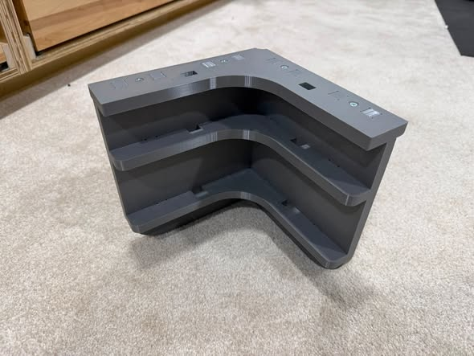
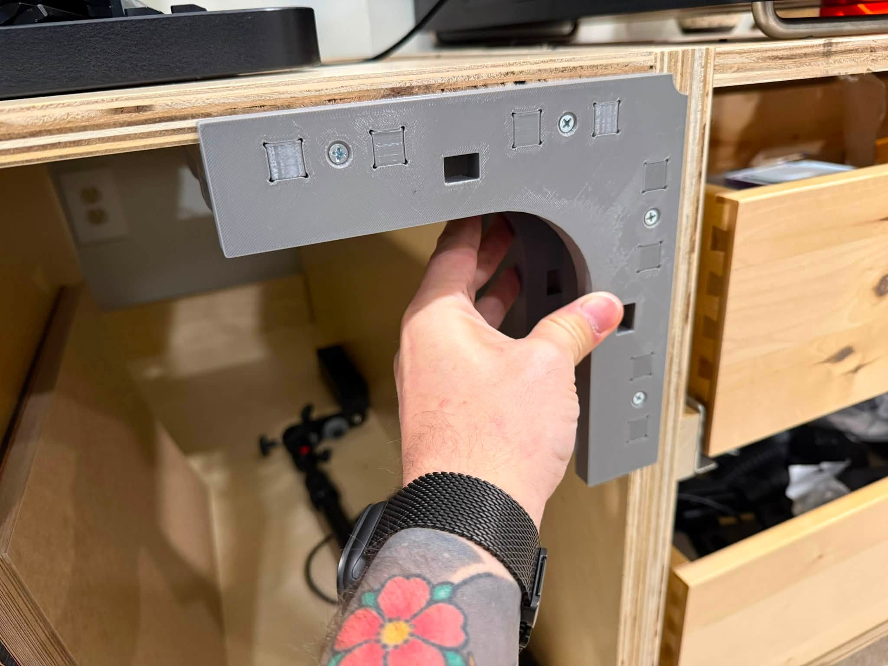
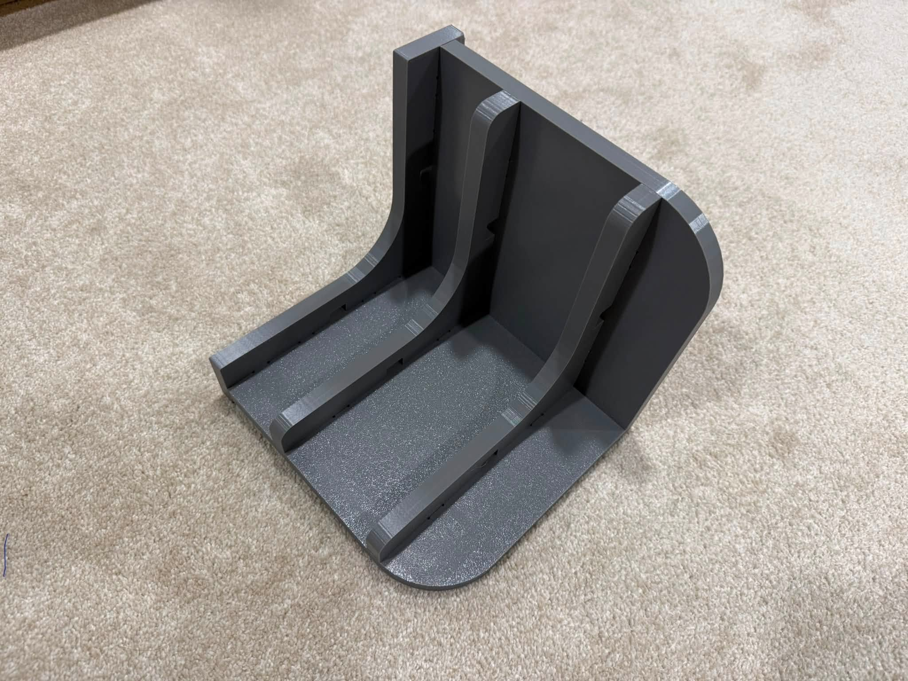
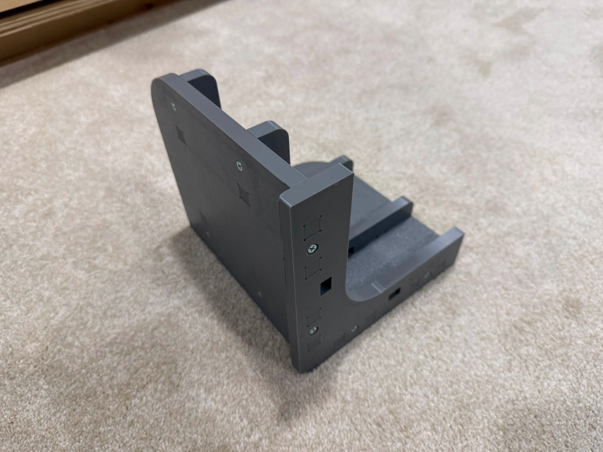

# 3D Clamping Jig

A 3D-printable clamping jig designed to make cabinet assembly easier. The jig holds panels square while you glue, clamp, and fasten cabinet carcasses — no more fumbling with corner squares and slipping panels.

## Parts

The jig consists of four printed parts:

| Part | STL | Description |
|------|-----|-------------|
| Top | `stl/3DClamp-Top.STL` | Top plate of the jig |
| Long Side | `stl/3DClamp-LongSide.STL` | Long side member |
| Short Side | `stl/3DClamp-ShortSide.STL` | Short side member |
| Inner Supports | `stl/3DClamp-InnerSupports.STL` | Internal support piece |

## Hardware

In addition to the printed parts, assembly requires:

| Qty | Hardware | Size |
|-----|----------|------|
| 14 | #6 wood screws | 1" long |

## Photos

The jig in use, holding a cabinet corner square during assembly:

Interior view — the ribs register both panels at a true 90°:

Exterior corner, showing the screw assembly:

## Repository layout

- `stl/` — Ready-to-print STL exports of each part
- `cad/` — SolidWorks source files (`.SLDPRT` parts and the `.SLDASM` assembly) for anyone who wants to modify the design
- `images/` — Photos of the printed and assembled jig

## Printing

Print the STLs in the `stl/` folder. PETG or ABS is recommended over PLA if the jig will see sustained clamping pressure, since PLA can creep under load. Orient parts flat-side down and use enough perimeters/infill to handle clamping force (4+ walls, ~40% infill is a good starting point).

## Modifying the design

The full SolidWorks assembly (`cad/3dClampJig.SLDASM`) and part files are included, so dimensions can be adapted to different panel thicknesses or cabinet sizes.

## License

This design is free for personal use — print it, modify it, and share it non-commercially with attribution. Commercial use, including selling prints or derivatives of this design, is not authorized. See [LICENSE](LICENSE) for details (CC BY-NC 4.0).
